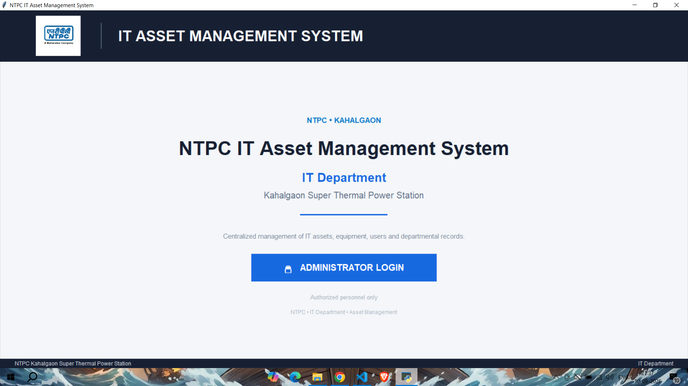
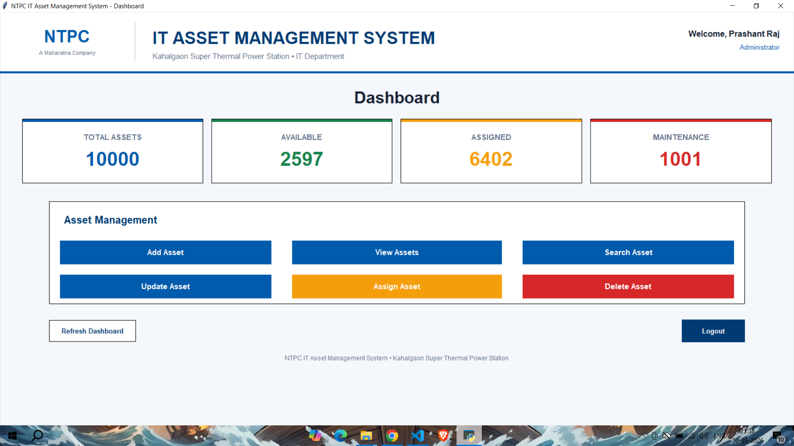
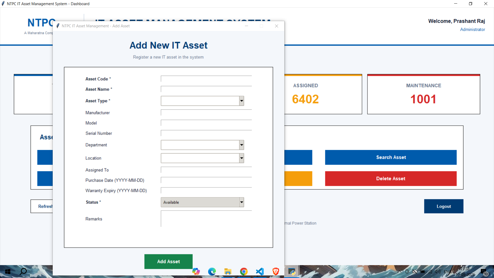
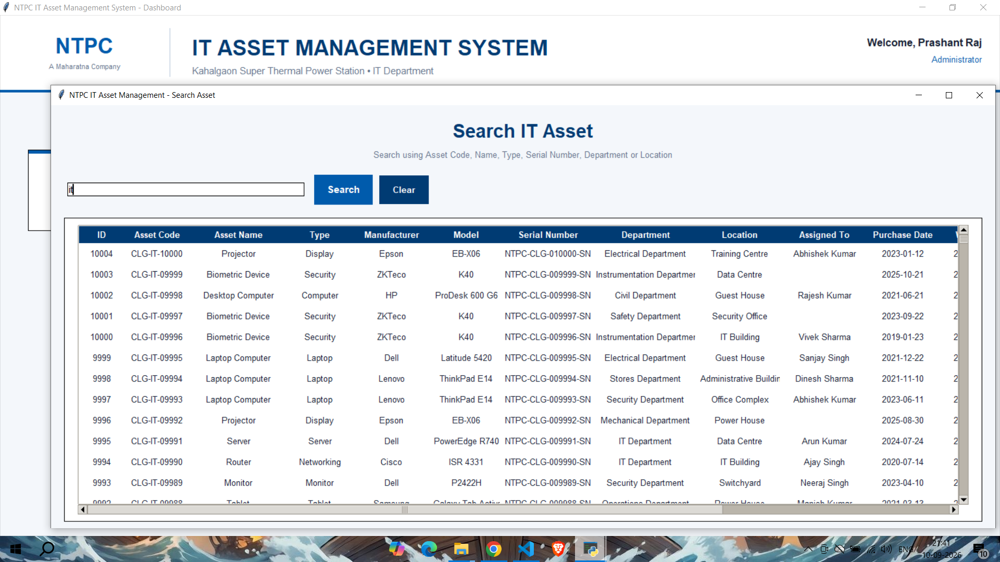
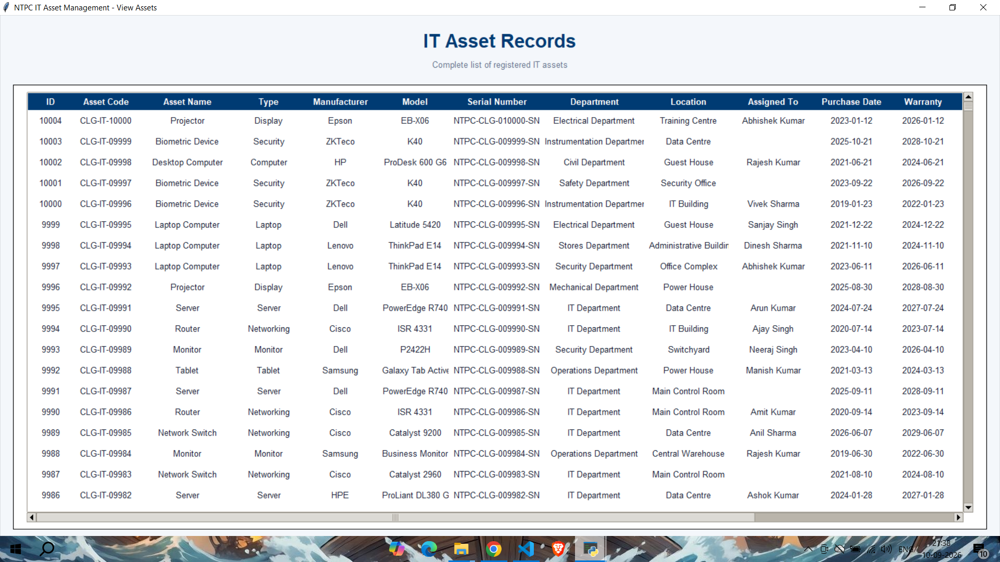
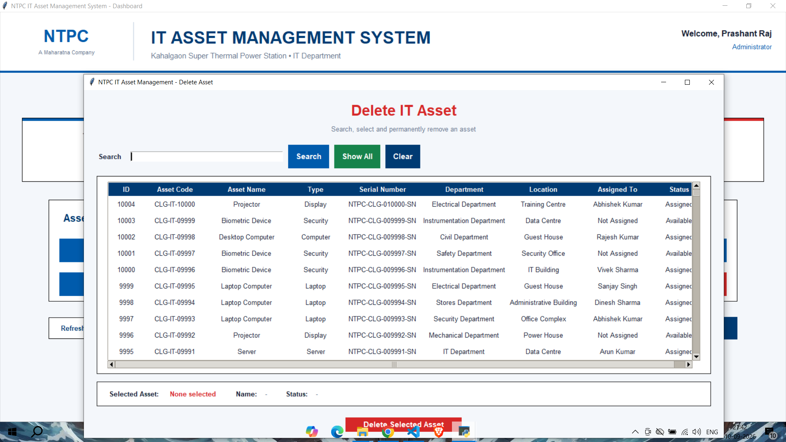
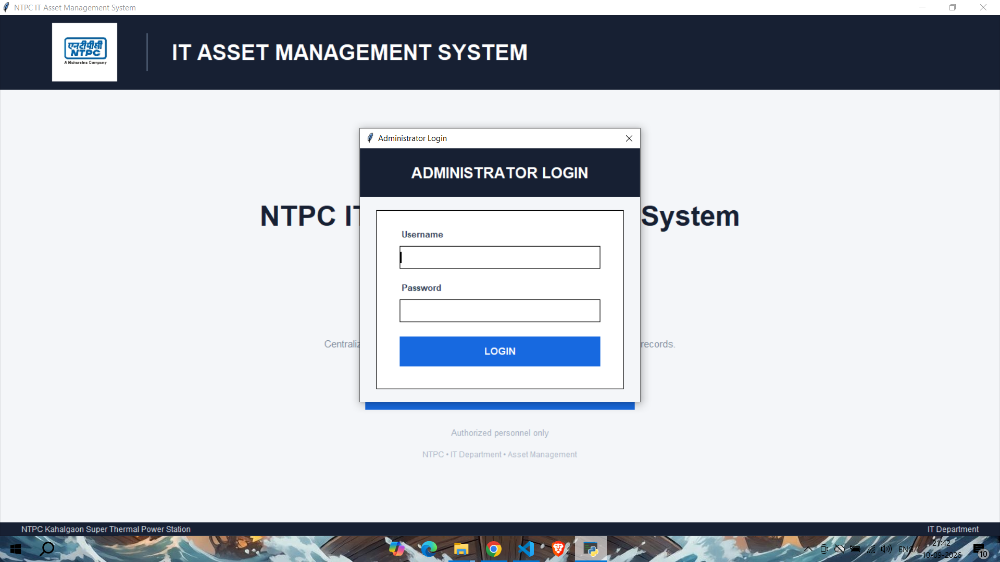

# NTPC IT Asset Management System

A desktop-based **IT Asset Management System** developed using **Python, Tkinter, and MySQL** to manage organizational IT assets efficiently through a centralized graphical interface.

## 📌 Project Overview

The NTPC IT Asset Management System provides a centralized platform for managing IT assets and their assignments. The application allows authorized administrators to register, search, update, assign, and delete asset records.

The system combines a **Tkinter-based GUI**, **MySQL database**, and **administrator authentication** to provide a structured solution for IT asset management.

## 🚀 Features

- 🔐 Administrator Login Authentication
- ➕ Add new IT assets
- 🔍 Search and view asset records
- ✏️ Update existing asset information
- 👤 Assign assets to employees
- 🗑️ Delete assets with administrator authorization
- 📊 Real-time asset statistics
- 🗄️ MySQL database integration
- 🖥️ User-friendly Tkinter GUI
- 🔒 Passwords and database credentials managed through environment variables

## 🛠️ Technologies Used

- **Python**
- **Tkinter**
- **MySQL**
- **MySQL Connector/Python**
- **python-dotenv**
- **bcrypt**

## 🗃️ Database Structure

The application uses a MySQL database named:

`Ntpc_Asset_Management`

The system consists of the following main tables:

- `assets`
- `employees`
- `users`
- `asset_assignments`

### Asset Information

The system maintains information such as:

- Asset ID
- Asset Code
- Asset Name
- Asset Type
- Manufacturer
- Model
- Serial Number
- Department
- Location
- Assigned Employee
- Purchase Date
- Warranty Expiry
- Status
- Remarks

## 🔐 Security

Sensitive database credentials are **not stored directly in the source code**.

Database credentials are loaded using environment variables through a `.env` file.

The `.env` file is excluded from Git using `.gitignore`.

> **Note:** This repository does not contain actual database credentials or sensitive authentication information.

## 📂 Project Structure

```text
ntpc-it-asset-management/
│
├── assets.py
├── create_admin.py
├── dashboard.py
├── data.py
├── database.py
├── login.py
├── main.py
├── NTPC.png
├── requirements.txt
├── .gitignore
└── README.md
```

## 📸 Screenshots

### 🔐 Administrator Login



### 📊 Dashboard



### ➕ Add New Asset



### 🔍 Search Assets



### 📋 Asset Records



### 🗑️ Delete Asset



### 🔒 Authentication



## ⚙️ Installation & Setup

### 1. Clone the repository

```bash
git clone https://github.com/rajprashant2064/ntpc-it-asset-management.git
```

### 2. Navigate to the project directory

```bash
cd ntpc-it-asset-management
```

### 3. Create a virtual environment

```bash
python -m venv .venv
```

### 4. Activate the virtual environment

**Windows:**

```bash
.venv\Scripts\activate
```

### 5. Install dependencies

```bash
pip install -r requirements.txt
```

### 6. Configure database credentials

Create a `.env` file in the project directory:

```env
DB_PASSWORD=YOUR_MYSQL_PASSWORD
```

Replace `YOUR_MYSQL_PASSWORD` with your local MySQL password.

### 7. Configure MySQL

Create the required database and tables according to the database configuration used by the application.

### 8. Run the application

```bash
python main.py
```

## 👨‍💻 Application Workflow

```text
Administrator Login
        ↓
    Dashboard
        ↓
 ┌──────┼────────┬─────────┐
 ↓      ↓        ↓         ↓
Add   Search   Update   Assign
Asset  Asset    Asset     Asset
        ↓
    View Records
        ↓
   Delete Asset
```

## 🎯 Project Highlights

- Centralized IT asset management
- Administrator-based access control
- CRUD operations for asset records
- Employee asset assignment
- MySQL-backed persistent data storage
- Real-time dashboard statistics
- Secure handling of database credentials
- Desktop GUI built with Tkinter

## 📚 Learning Outcomes

Through this project, I gained practical experience in:

- Python application development
- GUI development using Tkinter
- MySQL database integration
- CRUD operations
- Database connectivity
- Authentication and password hashing
- Environment variable management
- Modular Python application design
- IT asset lifecycle management

## 👤 Author

**Prashant Raj**

B.Tech Computer Science & Engineering

GitHub: [@rajprashant2064](https://github.com/rajprashant2064)

LinkedIn: [linkedin.com/in/prashantraj2064](https://www.linkedin.com/in/prashantraj2064)

---

⭐ If you find this project useful, consider giving it a star!
